# yet another buffer array...

| | | |
| :---: | :---: | :---: |
|  |  |  |

## why?

filament buffers are hard™

I didn't realize how hard until I ventured down this path.

I started like most do, and loyally printed some [ercf carrot patch](https://github.com/EtteGit/EnragedRabbitProject/tree/main/Carrot_Patch) units.  space limitations required me to mount them overhead, which is where things started to go sideways - every time I needed to put in new filament I had to find a chair and fsck around with the confined carrot patch space, sharp edges, filament whiplash, and whatnot - all overhead - until my shoulders hurt, cursing the entire time.  I figured there had to be a better way...  

it turns out, there really isn't.  yes, there's the nifty [buffer array usermod](https://github.com/EtteGit/EnragedRabbitProject/tree/main/usermods/ERCF-Buffer-Array), which saves on space but doesn't remove what turned out to be my main source of frustration - not having direct access to the wheel.  this alone generated so much yelling the neighbors started to complain.  beyond the carrot patch and its variants, remaining alternative solutions seemed to end in a single slot *hey lets shove the filament in this little space* approach.  given my 1200mm bowden path, those weren't poised to work out well unless I made them half a mile long.

all I wanted was a lightning-fast, super-simple, overhead-mounted, expletive-free, wheel-based, wicked-dependable filament buffer solution.  how hard could it be?

this thing here is where I ended up.

honestly, I'm surprised it actually worked... but it really does, and my experience has been frustration free ever since.  others on discord seem to have similarly joyful experiences with it as well, so I guess I'm on to something.

## what's here

* [assembly](#assembly)
  + [manual](#manual)
  + [printing](#printing)
  + [BOM](#bom)
  + [array](#array)
  + [buffer segments](#buffer-segments)
  + [tag plates](#tag-plates)
* [operation](#operation)
* [other stuff](#other-stuff)
* [pictures](#pictures)
* [credits](#credits)
* [other options](#other-options)

---

## assembly

hopefully, y'all find this pretty self explanatory, and can figure it out from the pictures.  basically, we have:

- a series of buffer slot slider thingies
- held together by a frame

that's about it.

the good news is that there's pretty much only one way the parts can go together, and everyone so far has found it pretty straightforward.  and in late breaking news, there's even [a manual](./assembly-manual.pdf)!

feel free to ping me on the [voron discord](https://discord.com/channels/460117602945990666/869236671554682990) in [`#ercf_questions`](https://discord.com/channels/460117602945990666/909743915475816458) if you have issues.  

### manual

and now... [a manual](./assembly-manual.pdf)

### printing

a few things to note when printing...

- **the models already oriented for optimal printing**.  no parts have included supports to remove, nor are supports necessary for any part.  if there are overhangs that need support the part is oriented incorrectly.
- due to bending of large parts, you want to **print the bottoms flat so that the latch fit is tight** - you'll only be able to print 1 or two of these at a time.
- conversely, **the tops are designed to be printed upright**, so go ahead and fill your plate.  if you care about a good looking bottom overhang, keep your exterior perimeter fans at 100% and engage them starting on layer 2.
- I used 20% infill and .2mm layer height on the tops and bottoms in order to keep parts light and plastic use down.  **ymmv**.
- I would suggest printing the latches and bracket using standard voron parameters (40% infill, .2mm layers, 4 perimeters) for added strength.
- the screen with the posts works best with higher temps and lower fan to keep the layers as strong as possible.  early versions had thinner posts, but the current version is a bit more rigid and should be less problematic.
- consider using setting `only_one_perimeter_first_layer` to `true` for the screens, which helps the first layer be a little more sane.  well, in superslicer, anyway.

### BOM

hopefully this is a full, accurate list...

| item                                               | 6 cart total | 9 cart total | 12 cart total |
| :---                                               | :---         | :---         | :---          |
| m3x8                                               | 38           | 53           | 68            |
| m3x8 flat head                                     | 12           | 18           | 24            |
| m3x12                                              | 6            | 9            | 12            |
| m3 nut                                             | 6            | 9            | 12            |
| m3 heatset                                         | 18           | 27           | 36            |
| [m2x8 self tapping](#m2x8-hex-cap-self-threading-screws)                                  | 42           | 63           | 84            |
| 608 bearing                                        | 6            | 9            | 12            |
| ecas connector                                     | 12           | 18           | 24            |
| [disc magnet](#a-note-on-magnets) (optional, depending on configuration) | 12           | 18           | 24            |
| PTFE/FEP 4mm OD x (2.5mm or 3.0mm ID) tubing       | variable     | variable     | variable      |

plus mounting hardware if you want to use the bottom bracket to mount the array on something.

the majority of the hardware was selected due to it being common across voron builds, so folks will likely have it just sitting around.  the big exception being the hole magnets...

#### a note on magnets...

I used these 10x3 disc magnets [from amazon](https://www.amazon.com/dp/B09ZLFNZ4S).  if those aren't available in your country, you're looking for 10x3 disc magnets with a 3mm hole in the middle, like these:

[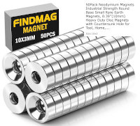](./images/magnets.png)

magnets with 4mm holes are a little better, but outside of the very first set I ordered I haven't been able to find any.

**just a small wrinkle...** as with the 6x3mm magnets for the ercf, the majority of "10x3mm" hole magnets in the wild are really around 9.5mm in diameter.  as such, the buffer parts are designed against this width.

 [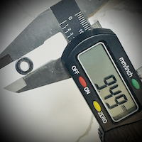](./images/magnet-lies.png)

if you have real 10mm magnets they'll be too large and you'll want to keep looking.  or maybe lightly sand the plastic, depending on how much room your magnets need.  solution coming soon™

#### m2x8 hex cap self threading screws

these m2x8 hex cap self threading screws [from amazon](https://www.amazon.com/gp/product/B00YBMRAH4) are really handy, both for this and other voron projects, like klicky.  m2x10 will also work in current buffer versions if those are easier to find.  

[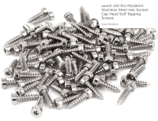](./images/screws.png)

### array

currently, there are 6, 9, and 12 slot versions, though only the 9 slot is tested at this point in time.  the only parts that differ are the side
latches and bottom bracket, which are easy for me to modify (and for you to print) if they don't work - just let me know.

| part                                                           | description                                       | required hardware | 
| :---                                                           | :---                                              | :---              |
| [`array-front.stl`](stl/array-front.stl)                       | front of array                                    | m3x8              | 
| [`array-front-screen.stl`](stl/array-front-screen.stl)         | front screen, to enclose the first buffer segment | m3x8 flat head    |
| [`array-back.stl`](stl/array-back.stl)                         | back of the array                                 | m3x8              |
| [`array-latch-9a.stl`](stl/array-latch-9a.stl)                 | side latch ([6](stl/array-latch-6a.stl) and [12](stl/array-latch-12a.stl) stls also provided)          | m3x8              |
| [`array-latch-9b.stl`](stl/array-latch-9b.stl)                 | side latch ([6](stl/array-latch-6b.stl) and [12](stl/array-latch-12b.stl) stls also provided)          | m3x8              |
| [`array-bottom-bracket-9.stl`](stl/array-bottom-bracket-9.stl) | bottom bracket ([6](stl/array-bottom-bracket-6.stl) and [12](stl/array-bottom-bracket-12.stl) stls also provided)      | m3x8              |

### buffer segments

one complete buffer required per cart

two top options are provided: choose either the one with two ecas connectors, or the one with one ecas and one disc magnet.

| part                                                               | description                                                   | required hardware   |
| :---                                                               | :---                                                          | :---                |
| [`buffer-bottom.stl`](stl/buffer-bottom.stl)                       | segment bottom                                                | m3 heatset          |
| [`buffer-top-ecas+ecas.stl`](stl/buffer-top-ecas+ecas.stl)         | segment top, both sides ecas connector                        | ecas                |
| [`buffer-top-ecas+magnet.stl`](stl/buffer-top-ecas+magnet.stl)     | segment top, one side ecas and one side disc magnet connector | ecas, [disc magnet](#a-note-on-magnets)   |
| [`buffer-top-magnet+magnet.stl`](stl/buffer-top-magnet+magnet.stl) | segment top, both sides disc magnet connector                 | ecas, [disc magnet](#a-note-on-magnets)         |
| [`buffer-bowden-magnet-end.stl`](stl/buffer-bowden-magnet-end.stl) | if you use either of the magnet tops                          | ecas, [disc magnet](#a-note-on-magnets)   |
| [`buffer-screen-a.stl`](stl/buffer-screen-a.stl)                   | segment screen for wheel                                      | m3x8 flat head      |
| [`buffer-screen-b.stl`](stl/buffer-screen-b.stl)                   | segment top screen                                            | [m2x8 self tapping](#m2x8-hex-cap-self-threading-screws) |
| [`buffer-bearing-insert.stl`](stl/buffer-bearing-insert.stl)       | holds the wheel in place                                      | m3x12, m3 nut       |
| [`buffer-handle.stl`](stl/buffer-handle.stl)                       | segment handle                                                | m3x8                |
| [`buffer-wheel.stl`](stl/buffer-wheel.stl)                         | wheel                                                         | 608 bearing         |

the wheel is same as the ercp wheel, except with a filament hole (with marker) for easier loading.  feel free to use the stock ercp wheel instead if you have some sitting around.

### tag plates

if you mount your buffer overhead your numbers will be upside down.  you can find upside down tag plates [here](https://github.com/geoffrey-young/3D-Printing/tree/main/models/voron/ercf/upside-down-numbers).

## operation

buffer operation made simple...

[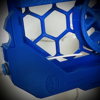](./images/operation-feed.png)  [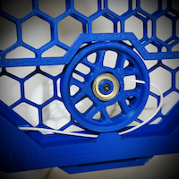](./images/operation-anchor.png)    [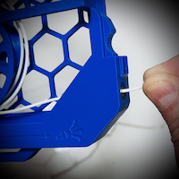](./images/operation-pull.png)

my setup is currently `ercf_calib_ref = 1146.4` and I use 5 loops/finger swoops.  ymmv.

there's also a video of the buffer in action I posted on discord that's worth a look:

- https://discord.com/channels/460117602945990666/708772910956937336/1038298353324273754

the number of people who haven't figured out the spin-the-wheel-with-your-finger method is significantly higher than I would have imagined.

"but how fast and easy is it to load... really?" I hear you cry.  allow satisfied discord user `@ningj V2.2726` to show you:

- https://discord.com/channels/460117602945990666/909743915475816458/1089361904650162266

## other stuff

I mounted my ercf at 90 degrees using a french cleat system, which you can find [here](https://github.com/geoffrey-young/3D-Printing/tree/main/models/voron/ercf/mounts/ercf-french-cleat).

the 90 degree mounting created some challenges accessing the filament block ecas connectors, so I made [an extension](https://github.com/geoffrey-young/3D-Printing/tree/main/models/voron/ercf/extender) to help.

a magnetic bowden "bridge" (plus some springs) keeps my bowden tubes straight, clear, and managed.  available [here](https://github.com/geoffrey-young/3D-Printing/tree/main/models/voron/ercf/mounts/bridge).

## pictures

some reference photos, videos, etc

| artie `v2.1650` | | |
| :--- | :--- | :--- |
|  | [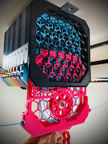](./images/buffer-wheel-1.jpg) | [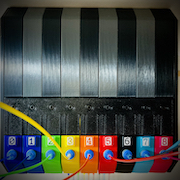](./images/buffer-2.jpg) |
|  |  | [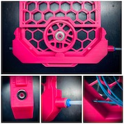](./images/path.jpg) |
| [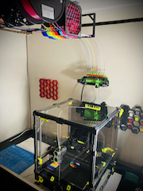](./images/artie.jpg) | [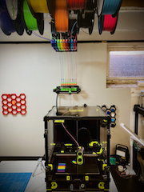](./images/artie-2.jpg) | [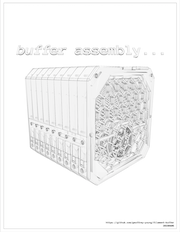](./assembly-manual.pdf) |

| other users on discord| |
| :--- | :--- |
|  |  |
|  |  |

pull requests with your (single) picture added most welcome.

## credits

- the entire concept here started after seeing [this mmu buffer on printables.com](https://www.printables.com/model/30811-mmu-slot-buffer).  while my work isn't really a mod of that (I modeled everything myself from scratch), I did copy the latch concept nearly... verbatim?  I'm sure there's a word for it.  anyway, the latch works really well, and needless to say I coudn't have figured a mechanism like that on my own.  this project owes sincere credit and gratitude to all the work and effort over there.  many thanks!

- all the fittings and cutouts - ecas and m3 holes, bridging, etc - were taken directly from either the [ercf project](https://github.com/EtteGit/EnragedRabbitProject) or the [voron 2.4 project](https://github.com/VoronDesign/Voron-2/).  since I use blender and don't cad, I really appreciate all the community work that has gone into getting those measurements and fit tricks just right.  kudos to team voron, be they enraged or not.

- the buffer wheel is taken right from [ercf project](https://github.com/EtteGit/EnragedRabbitProject).  no need to reinvent the wheel...

- [deepfriedhero](https://dfh.fm), [west3d](https://west3d.com), and [fabreeko](https://www.fabreeko.com) for consistently fantastic parts and service

- I'm super grateful for some early beta testers, who provided really valuable feedback:
  - `@TheTechRunner V2.1453 V0.1556`
  - `@ningj V2.2726`

- probably others - if you feel left out let me know :)

## other options

some other proven buffers that may suit your needs:

- [carrot quiver](https://github.com/SkiBikePrint/ERCF_Mods/tree/main/Carrot_Quiver_Buffer)
- [ercf buffer array](https://github.com/EtteGit/EnragedRabbitProject/tree/main/usermods/ERCF-Buffer-Array)
